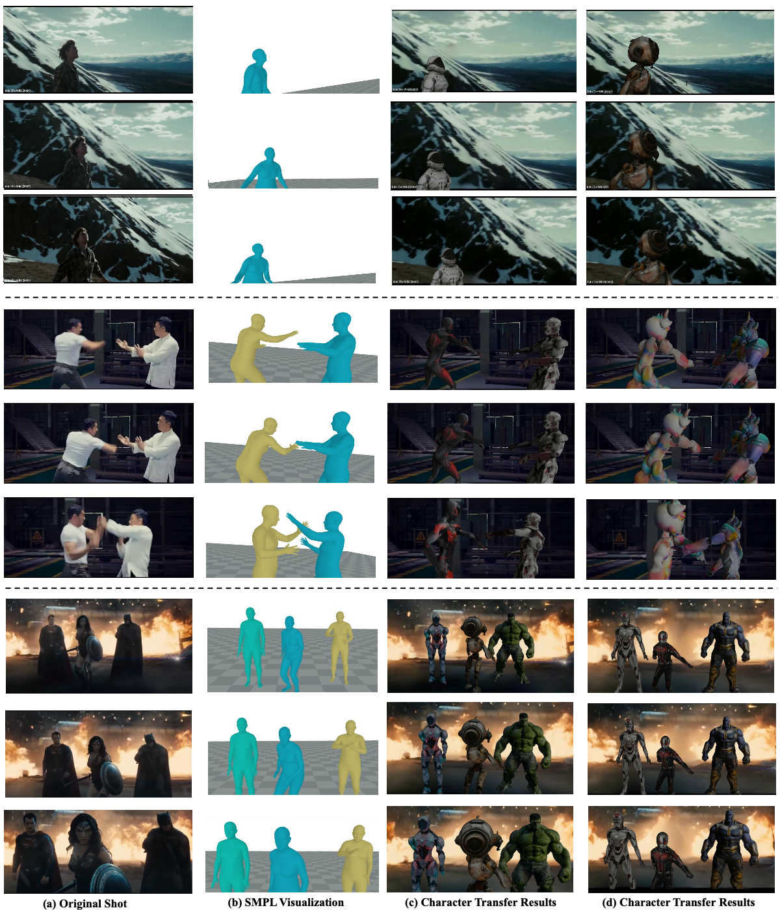

# DreamCinema: Cinematic Transfer with Free Camera and 3D Character

[**Paper**](https://arxiv.org/abs/2408.12601) | [**Project Page**](https://liuff19.github.io/DreamCinema//) | [**Video**](https://youtu.be/kwfRetxDgsg)

Official implementation of DreamCinema: Cinematic Transfer with Free Camera and 3D Character

Weiliang Chen, [Fangfu Liu](https://liuff19.github.io/)$\dagger$, Diankun Wu, Haowen Sun, Haixu Song, [Yueqi Duan](https://duanyueqi.github.io/)$\ddagger$

$\dagger$ Project leader $\ddagger$ Corresponding author

<p align="center"> All Code will be released soon... 🏗️ 🚧 🔨</p>

Abstract: *We are living in a flourishing era of digital media, where everyone has the potential to become a personal filmmaker. Current research on cinematic transfer empowers filmmakers to reproduce and manipulate the visual elements (e.g., cinematography and character behaviors) from classic shots. However, characters in the reimagined films still rely on manual crafting, which involves significant technical complexity and high costs, making it unattainable for ordinary users. Furthermore, their estimated cinematography lacks smoothness due to inadequate capturing of inter-frame motion and modeling of physical trajectories. Fortunately, the remarkable success of 2D and 3D AIGC has opened up the possibility of efficiently generating characters tailored to users' needs, diversifying cinematography. In this paper, we propose **DreamCinema**, a novel cinematic transfer framework that pioneers generative AI into the film production paradigm, aiming at facilitating user-friendly film creation. Specifically, we first extract cinematic elements (i.e., human and camera pose) and optimize the camera trajectory. Then, we apply a character generator to efficiently create 3D high-quality characters with a human structure prior. Finally, we develop a structure-guided motion transfer strategy to incorporate generated characters into film creation and transfer it via 3D graphics engines smoothly. Extensive experiments demonstrate the effectiveness of our method for creating high-quality films with free camera and 3D characters.*

<p align="center">
    
</p>

## Method
Our framework includes cinematic elements extraction, character generation, and cinematic transfer optimization. The cinematic elements extraction estimates character motion and cinematography. The character generation module creates 3D characters tailored to user preferences with human structure prior. The cinematic transfer optimization integrates the extracted cinematic elements and the generated 3D characters with structure-guided motion transfer. The complete pipeline is as follows:
<p align="center">
    
</p>

## Cinematic Transfer Results

DreamCinema generates diverse characters with high quality and alignment to user preferences and selectively transfer these cinematic behavior (e.g. cinematography and character motions) to the new characters.
<p align="center">
    
</p>

## Cinematic Transfer Results

Thanks Kailu Wu and April for their insightful discussions during our work. We would also like to thank Haowen Sun for his significant contributions to the demo video.


## BibTeX

```
@misc{chen2024dreamcinemacinematictransferfree,
      title={DreamCinema: Cinematic Transfer with Free Camera and 3D Character}, 
      author={Weiliang Chen and Fangfu Liu and Diankun Wu and Haowen Sun and Haixu Song and Yueqi Duan},
      year={2024},
      eprint={2408.12601},
      archivePrefix={arXiv},
      primaryClass={cs.CV},
      url={https://arxiv.org/abs/2408.12601}, 
}
```
